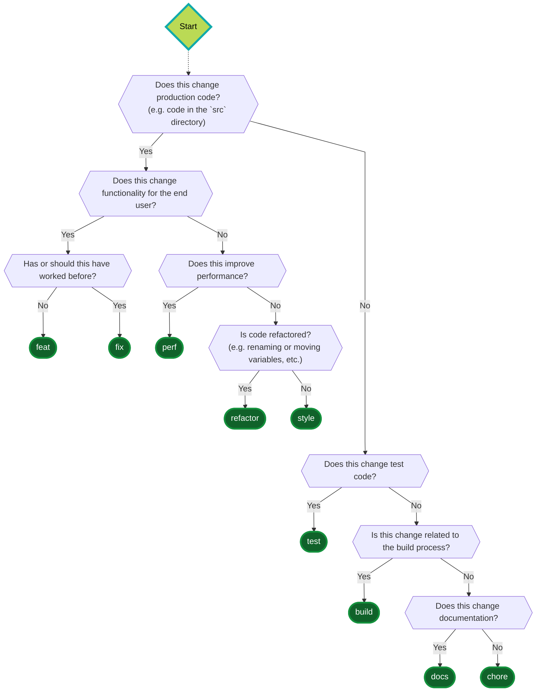

# Developer Guide for contributing to MyParcel repositories

This document is a guide for developers who want to contribute to MyParcel repositories. It contains information about the development process, how to create a pull request and how to write a good commit message.

## Pull requests

- A pull request should contain a single feature or bug fix.
- A pull request should be as small as possible. This makes it easier to review and merge.
- The title and description of the pull request must comply with the rules in [Commit messages](#commit-messages).

## Commit messages

We use [Conventional Commits](https://www.conventionalcommits.org/en/v1.0.0/) to standardize our commit messages. This makes it easier to generate changelogs and release notes.

Read the [conventional commit specification](https://www.conventionalcommits.org/en/v1.0.0/#specification) for in-depth information about the commit message format.

Most of what is written in the specification is also explained in the following sections.

### Anatomy of a commit message

```text
<type>(<scope>): <subject>
<BLANK LINE>
<body>
<BLANK LINE>
<footer>
```

**Required:**

- `type`: The type of commit. See [Types](#types).
- `subject`: The subject of the commit. This is a short description of the commit. It should not contain more than 50 characters.

**Optional:**

- `scope`: The scope of the commit. This is the part of the code that is affected by the commit. For example: `api`, `webhook`, `frontend`, `backend`, `cli`, `docs`, `tests`, etc. This can be omitted if the scope is not relevant. The value of the scope depends on the project you're working on.
- `body`: The body of the commit. This is a longer description of the commit. It can contain multiple lines. Capitalization is allowed.
- `footer`: The footer of the commit. This is used to reference issues. For example: `Closes #123`, `Closes #123, Closes #456, ...`. Capitalization is allowed.

### Rules

- Use the imperative mood in the subject line. 
  - For example: "Fix bug" instead of "Fixed bug" or "Fixes bug".
- Do not capitalize the subject line.
- Do not end the subject line with a period.
- Use the body to explain the "what" and "why" of the commit, not the "how". 
  - For example: "This commit fixes a bug" instead of "This commit fixes a bug by changing the code in this way".
- If the commit fixes an issue, add "Closes #issue-number" to the body.
  - In case there are multiple issues, add "Closes #issue-number, Closes #issue-number, ..." to the body.

> The header of your commit should be your pull request title, and the body should be your pull request description.

> See the [correct examples](#correct-examples) and [incorrect examples](#incorrect-examples) for more information.

### Types

In the commit message, the type is the first word in the subject line. It is followed by a colon and a space. The type can be one of the following:

- `feat`: A new feature.
- `fix`: A bug fix.
- `perf`: A change that improves performance but does not affect the meaning of the code.
- `style`: A change that does not affect the meaning of the code. For example: formatting, adding missing semicolons, automatic fixes by linters, etc.
- `refactor`: A change that neither fixes a bug nor adds a feature. For example: renaming a variable, moving a function, etc.
- `build`: A change that affects the build process, e.g. changing the build tool, updating GitHub actions workflows, changing scripts in `package.json`, etc.
- `chore`: A change that does not affect the meaning of the code. For example: updating `.gitignore`, `.github/CODEOWNERS`, `LICENSE` etc.
- `docs`: A change that only affects documentation, e.g. README.md, CONTRIBUTING.md, etc.

#### Flowchart

Here's a flowchart to help you decide on what type you should use in your commit message.



### Correct examples

#### ✅ Simple commit

```text
feat: add new feature
```

#### ✅ With scope

```text
feat(api): add new feature
```

#### ✅ With body and footer

```text
feat: add new feature

This is a longer description of the feature. It can contain multiple lines.

Closes #123
```

### Incorrect examples

#### ❌ Capitalized subject

```text
Feat: add new feature
```

#### ❌ Subject ending with a period

```text
feat: add new feature.
```

#### ❌ Subject line too long

```text
feat: add new feature that is longer than 50 characters
```

#### ❌ Subject not in imperative mood

```text
feat: new feature
```

```text
feat: added new feature
```

#### ❌ Body not separated from header

```text
feat: add new feature
This is a longer description of the feature. It can contain multiple lines.
```

#### ❌ Body not separated from footer

```text
feat: add new feature

This is a longer description of the feature. It can contain multiple lines.
Closes #123
```
